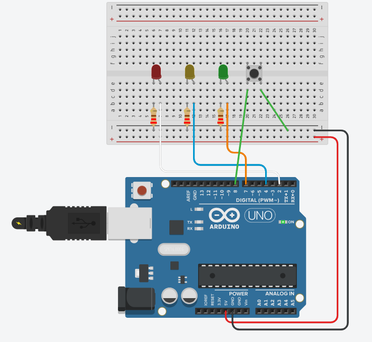

# Documentação Técnica — Projeto Semáforo com Arduino (com botão liga/desliga)

---

## Objetivo

&nbsp; Este documento descreve em detalhes a montagem física, o funcionamento do código e a avaliação conforme o barema do projeto **Semáforo com Arduino**.  

&nbsp; O objetivo é demonstrar o controle de saídas digitais, o uso de temporizações sem o uso de `delay()` e a implementação de um sistema interativo com botão liga/desliga que permite pausar e retomar o ciclo do semáforo.

---

## Descrição do Projeto

&nbsp; O projeto consiste em um sistema eletrônico de sinalização baseado em três LEDs controlados por um Arduino UNO.  

&nbsp; Cada LED representa uma luz do semáforo (vermelha, amarela e verde), com tempos ajustados para imitar o comportamento de um cruzamento urbano.  

&nbsp; O sistema agora conta com um botão físico que permite ligar e desligar o funcionamento do semáforo.  
Quando o botão é pressionado:
- Se o sistema estiver ligado, ele desliga todas as luzes (pausando o funcionamento).  
- Se estiver desligado, ele reinicia o ciclo a partir do sinal vermelho.

---

## Lógica de Funcionamento

| Fase | LED | Cor | Tempo | Função |
|------|------|------|--------|----------|
| 1 | 2 | 🔴 Vermelho | 6 segundos | Indica “pare” |
| 2 | 7 | 🟢 Verde | 4 segundos | Indica “siga” |
| 3 | 4 | 🟡 Amarelo | 2 segundos | Indica “atenção” |

&nbsp; O ciclo é repetido continuamente enquanto o sistema estiver ligado.  
&nbsp; Ao pressionar o botão, o ciclo é interrompido e todas as luzes são apagadas.  
&nbsp; Ao pressionar novamente, o ciclo recomeça automaticamente na fase vermelha, garantindo uma retomada segura do fluxo.

---

## Componentes Utilizados

| Componente | Quantidade | Especificação | Função |
|-------------|-------------|----------------|----------|
| Arduino Uno | 1 | ATmega328P | Microcontrolador do sistema |
| LED Vermelho | 1 | 5mm | Representa o sinal de parada |
| LED Amarelo | 1 | 5mm | Representa o sinal de atenção |
| LED Verde | 1 | 5mm | Representa o sinal de passagem |
| Resistores | 3 | 220 Ω | Limitam a corrente dos LEDs |
| Botão (push button) | 1 | - | Liga/desliga o sistema |
| Protoboard | 1 | - | Montagem sem solda |
| Jumpers | Vários | Macho–macho e Fêmea-macho| Conexões entre os componentes |

---

## Esquema de Ligação

&nbsp; A montagem foi realizada em protoboard, de forma a facilitar testes e ajustes.

**Conexões principais:**
- LED Vermelho → pino **2**
- LED Amarelo → pino **4**
- LED Verde → pino **7**
- Botão → pino **8** (com resistor interno de pull-up)
- Cátodos (pernas curtas dos LEDs) → GND (via resistores de 220 Ω)

Semáforo Tinkercad  
  
Fonte: Material produzido pelos autores (2025)

---

## Código do Projeto

[semaforo_botao.cpp](./semaforo_botao.cpp)

---

## Explicação do Código

### Estrutura com Programação Orientada a Objetos (POO)

O código foi desenvolvido com base em classes para organizar melhor a lógica do sistema.  
A classe `Semaforo` encapsula os pinos, tempos e métodos de funcionamento do semáforo.

Principais métodos:

- **`inicializar()`** – configura os pinos como entrada/saída e apaga todos os LEDs.  
- **`verificarBotao()`** – detecta o pressionamento do botão e alterna o estado do sistema entre ligado e desligado (usando debounce).  
- **`executarCiclo()`** – controla o acendimento das luzes com base no tempo decorrido desde a última mudança de estado, sem usar `delay()`, permitindo leitura contínua do botão.  
- **`desligarTodasLuzes()`** – apaga todos os LEDs, usada ao desligar o sistema.  

---

## Parte Extra — Lógica do Botão Liga/Desliga

&nbsp; Como melhoria ao semáforo simples, foi implementado um sistema interativo com botão.  
&nbsp; Essa funcionalidade permite ao usuário pausar o semáforo e retomar o ciclo de forma controlada.

**Comportamento do botão:**
1. Quando o botão é pressionado pela primeira vez, o sistema é ligado, iniciando o ciclo normal a partir do vermelho.  
2. Ao pressionar novamente, o sistema para completamente, desligando todos os LEDs.  
3. Ao pressionar mais uma vez, o ciclo retorna novamente a partir do sinal vermelho, reiniciando a sequência de tempos.

Essa lógica foi implementada utilizando:
- Leitura digital do botão (`digitalRead()`),  
- Controle de estado lógico (`sistemaLigado`),  
- E detecção de borda (mudança de estado do botão de HIGH → LOW).

O uso da função `millis()` substitui `delay()`, permitindo o controle de tempo sem bloquear o código — assim o Arduino consegue ler o botão a qualquer momento, mesmo durante o ciclo das luzes.

---

## Conclusão

&nbsp; O projeto demonstrou o funcionamento completo de um sistema sequencial com controle digital e interação por botão físico.  

&nbsp; Foi possível compreender conceitos de temporização sem bloqueio, uso de classes (POO) e controle lógico de estados no Arduino.  

&nbsp; A adição do botão liga/desliga tornou o projeto mais interativo e realista, aproximando-o do comportamento de sistemas reais de controle de tráfego.  

&nbsp; Essa implementação pode ser expandida futuramente para incluir sensores de presença, controle remoto, ou integração com módulos IoT.

---